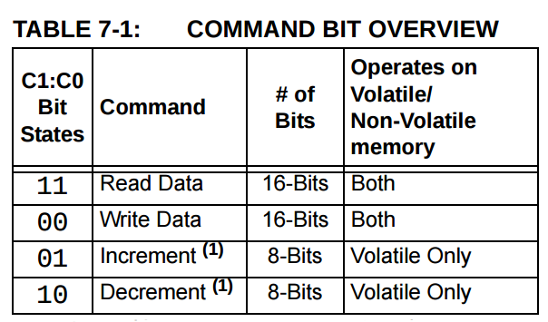
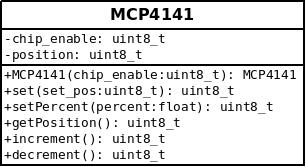

#MCP4141 Arduino Lib

## What is a MCP4141?

An MCP41XX is a SPI 7 bit digital Potentiometer, that can be controlled using just sending a few registers over the SPI bus. Thos command are descrived in the [datasheet](http://ww1.microchip.com/downloads/en/DeviceDoc/22059b.pdf) in the pages 45-46.

## Class Description UML

### Atributes

* **chip_enable:** This value store the chip enable pin used to connect the mcp4141
* **position:** This value store the position of the wiper of the mcp4141

### Methods

* **MCP4141:** Constructor class, takes the value of the chip select pin as parameter
* **set:** Sets the wiper to a position between 0-127, the desired position as parameter, returns the actual value of the position.
* **setPercent:** Sets the wiper to a position proportional between 0 and 100%, takes the required percent as parameter, returns the actual value of the position.
* **getPosition:** Gets the position of the mcp4141, returns the actual value of the position.

* **increment:** Increment the position by one, returns the actual value of the position.

* **decrement:** Decrement the position by one, returns the actual value of the position.
